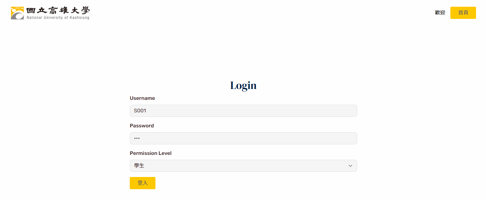
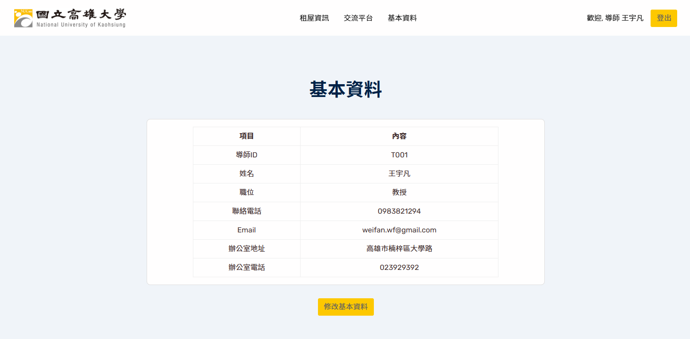
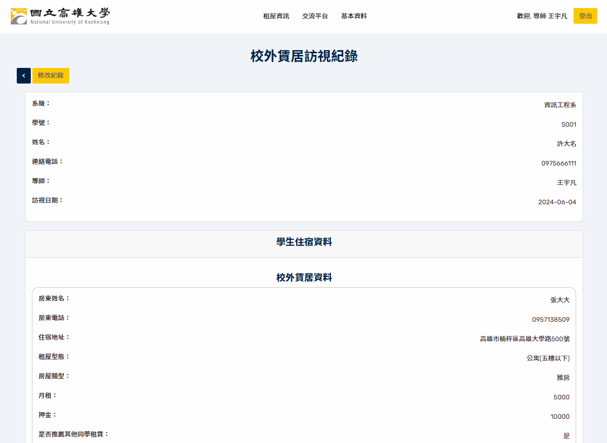
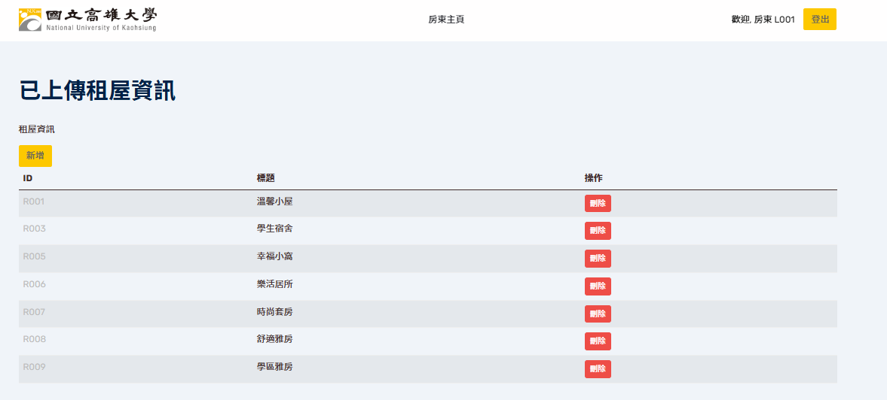
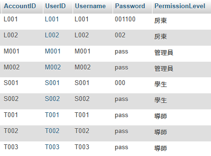

# offcampus-housing-nuk

**Off-campus housing management system for National University of Kaohsiung students.**  
校外住宿管理系統，用於協助導師管理學生住宿資料與租屋資訊整合。

---

## 📁 Repository Structure

OFFCAMPUS-HOUSING-NUK/
├── database/ # 資料庫檔案與設計文件
│ ├── sams.sql # 主資料庫匯入檔
│ ├── sams_0615.sql # 備份版本
│ ├── sams_empty.sql # 無資料版本
│ └── database_design.docx # 資料庫欄位說明文件
│
├── sams/ # 系統核心模組
│ ├── RS/ # 租屋子系統
│ ├── VAS_student/ # 學生介面
│ ├── VAS_Teacher/ # 導師介面
│ └── system/ # 系統管理模組
│
├── static/ # CSS、圖片等靜態資源
│
└── README.md # 專案說明文件

---

## 🖥️ System Overview

本系統 SAMS（Student Accommodation Management System）可協助導師管理校外住宿學生資料與訪視紀錄，同時整合租屋資訊供查詢，功能分為五個子系統：

---

### 🔐 Subsystem SAS - 系統管理

管理者用於登入驗證與帳號管理。
- Login Management：使用者登入驗證
- Account Management：帳號新增、修改、刪除
- Basic Information Management：檢視與修改基本資料

---

### 🏠 Subsystem RS - 租屋資訊平台

提供一般學生使用，功能包含租屋交流與刊登：
- Account & Profile Edit：修改帳號與基本資料
- Rental Ads：瀏覽、刊登租屋廣告
- Rental Review：發表租屋評價
- Rental Exchange：租屋經驗交流發文/留言

---

### 🛠 Subsystem RIES - 租屋資訊管理者

管理租屋資訊與用戶發布的內容：
- Ad Management：審核、搜尋、刪除廣告
- Forum Moderation：刪除租屋交流文章

---

### 🧾 Subsystem VAS - 訪視資料管理

導師/系統管理員用來管理住宿與訪視紀錄：
- Visit Record Management：整合住宿與訪視紀錄查詢
- Visit Result Edit：新增與編輯訪視結果
- Student Accommodation Info：編輯住宿與自主管理檢視資料

---

### 🗄️ Subsystem DBS - 資料庫存取系統

統一處理所有子系統與 MySQL 的資料存取請求，進行資料的新增、修改、刪除與查詢。

---
## 🖼 系統畫面截圖

### 🏠 首頁

### 🔐 登入畫面

### 👤 使用者個人頁面

### 📋 訪視紀錄瀏覽

### 📋 房東上傳租屋紀錄瀏覽

### ⚙️ 可使用以下不同身分帳號做測試

---
## 🚀 Usage
1. 安裝 XAMPP / WAMP 或其他 PHP+MySQL 環境
2. 將本專案資料夾放入相應目錄
3. 使用 phpMyAdmin 匯入 `sams.sql` 
4. 根據你的環境，修改各模組中的 connect.php、db_connect.php檔案，以正確連線至 MySQL。
4. 開啟 [http://127.0.0.1:5050/sams/](http://127.0.0.1:5050/sams/) 開始使用

---

## ⚙️ Technologies Used

- PHP + MySQL
- phpMyAdmin for DB management
- HTML/CSS for UI rendering

---

## 🏫 Project Info

- **University**：National University of Kaohsiung（國立高雄大學）
- **Course**：Software Engineering / 軟體工程
- **Team Project**：多人合作專案

